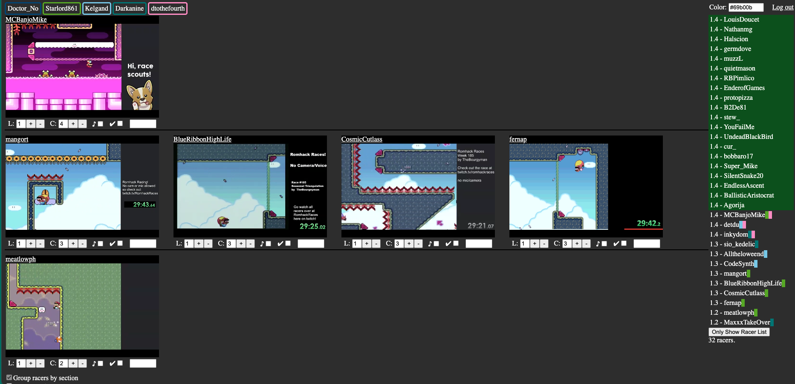

# Code Examples
Code snippets from private projects that I am able to share.

## Sir Botis
[Sir Botis](https://sirbotis.com) is a set of tools for Twitch streamers to use. The primary focus is on minimalistic overlays, but it also provides Twitch Chat and Discord bot functionality.

Botis' backend functionality is created in Node in a microservice architecture, currently split across 13 applications that talk to each other through a custom socket listener. Data is sent in JSON format to allow for future microservices to be written in languages best suited to the tasks they are trying to perform.

The front end is written in React. The website is a single page application using Twitch OAuth to authenticate users, while stream overlays are their own React components and use websockets to receive events in real time from the web server.

## Romhack Races Scout Tool

[Romhack Races](https://romhackraces.com/) is a community that hosts weekly blind races of Super Mario World romhacks (and occasionally other games). A new, never before seen level is made by a different creator every week. This is tested and rated by RHR volunteers, and folks in the community sign up to partake in the race. 5 minutes before race time the level patch is distributed to the racers, and the race is streamed on Twitch.

Due to the race stream only being able to viably show 4 racers at a time and many more than that sign up, a team of Scouts watch the Twitch streams of all of the racers to alert the restreamer when someone passes the four racers currently being restreamed. This Scout Tool allows the Scouts to coordinate who is scouting which racer and where they are in the level as well as automatically mute and lower the resolution on the incoming stream to lower the resources needed by a Scout, allowing each scout to effectively watch more racers.

## EZ Community
[EZ Community](https://ez.community) is an info site for the virtual reality game Zenith MMO. Data for the website was collected by EZ guild members. The most used component is the Map page. It uses map tiles created from the in-game map, displayed in Leaflet.js. Code samples are from when I left the project and do not reflect the exact current state of the site, though the code is still in use.